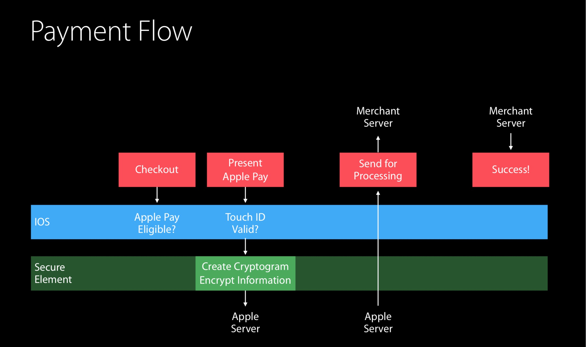

# Implementing Apple Pay

Follow the instructions in [Configure Apple Pay (iOS, watchOS)](https://help.apple.com/developer-account/#/devb2e62b839), which guide you to create the following:

- **Merchant ID.** An identifier you register with Apple that uniquely identifies your business as a merchant able to accept payments. This ID never expires, and can be used in multiple websites and iOS apps. See [Create a merchant identifier](https://help.apple.com/developer-account/#/devb2e62b839?sub=dev103e030bb) for the setup steps.
- **Payment Processing Certificate.** A certificate associated with your merchant ID, used to secure transaction data. Apple Pay servers use the certificate’s public key to encrypt payment data. You (or your payment service provider) use the private key to decrypt the data to process payments. See [Create a payment processing certificate](https://help.apple.com/developer-account/#/devb2e62b839?sub=devf31990e3f) for the setup steps.
- Finally, you need to enable the Apple Pay capability in your Xcode project. See [Enable Apple Pay](https://help.apple.com/xcode/mac/9.3/#/deva43983eb7?sub=dev44ce8ef13) for the setup steps.

苹果支付Server 使用证书的公钥加密数据，支付Server使用私钥解密数据

### 创建商家标识符

**商家标识符**用于向 Apple Pay 唯一地识别您可接受付款的商家身份。您可以在多个原生 app 和网页版 app 中使用同一个商家标识符。商家标识符不会过期。

1. 在“[Certificates, Identifiers & Profiles](https://developer.apple.com/account/ios/certificate)”(证书、标识符和描述文件) 中，从左侧弹出式菜单中选取“iOS, tvOS, watchOS”。
2. 在“Identifiers”(标识符) 下面，选择“Merchant IDs”(商家 ID)，然后点按右上角的添加按钮 (+)。
3. 输入商家描述和标识符名称，然后点按“Continue”(继续)。

4. 检查设置，然后点按“Register”(注册)。
5. 点按“Done”(完成)

### 创建付款处理证书

**付款处理证书**与商家标识符相关联，用于加密付款信息。付款处理证书的有效期为 25 个月。如果证书被撤销，您可以重新创建一个。

1. 在“[Certificates, Identifiers & Profiles](https://developer.apple.com/account/ios/certificate)”(证书、标识符和描述文件) 中，从左侧弹出式菜单中选取“iOS, tvOS, watchOS”。

2. 在“Identifiers”(标识符) 下面，选择“Merchant IDs”(商家 ID)。

3. 在右侧，选择您的商家标识符，然后点按“Edit”(编辑)。

   *【注】*如果页面顶部出现横幅，指示您需要接受协议，请点按“Review Agreement”(查看协议) 按钮，并根据说明继续操作。

4. 在“Apple Pay Merchant Identity Certificate” 栏目下，点按“Create Certificate”(创建证书)。

### Configure Apple Pay (iOS, watchOS)

1. In the [project editor](https://help.apple.com/xcode/mac/9.3/#/devdab46c612), select the target and click Capabilities.
2. In the Apple Pay section, click the switch to turn it from OFF to ON.

###支付流程

> https://developer.apple.com/apple-pay/implementation/
>
> [Setting Up Apple Pay Requirements](https://developer.apple.com/documentation/passkit/apple_pay/setting_up_apple_pay_requirements?language=objc)
>
> [配置 Apple Pay (iOS、watchOS)](https://help.apple.com/developer-account/#/devb2e62b839?sub=dev103e030bb)
>
> [iOS内购(IAP,In App Purchases-在APP内部支付),设置及使用](https://www.jianshu.com/p/f7bff61e0b31)
>
> [Apple Pay](https://www.jianshu.com/p/8d7b86f1d142)
>
> [ApplePay&IAP](<https://www.jianshu.com/p/f2de9512f212>)
>
> [iOS_Security_Guide](https://www.apple.com/business/docs/site/iOS_Security_Guide.pdf)

